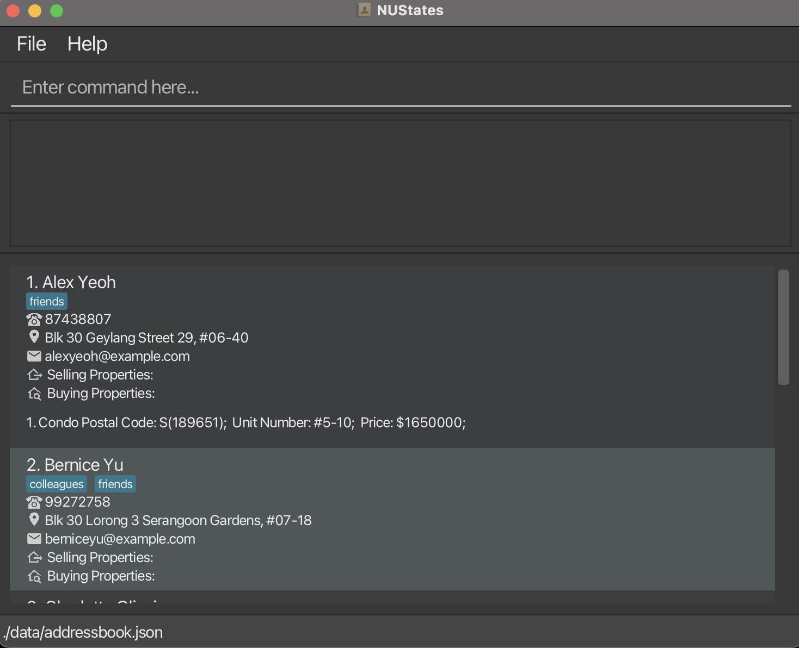
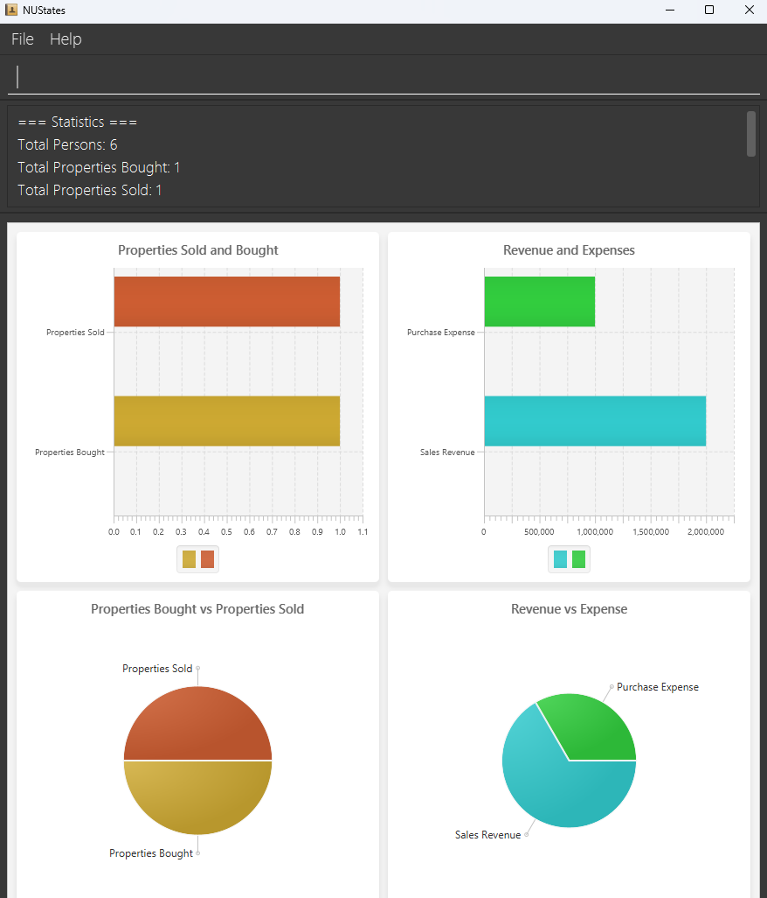
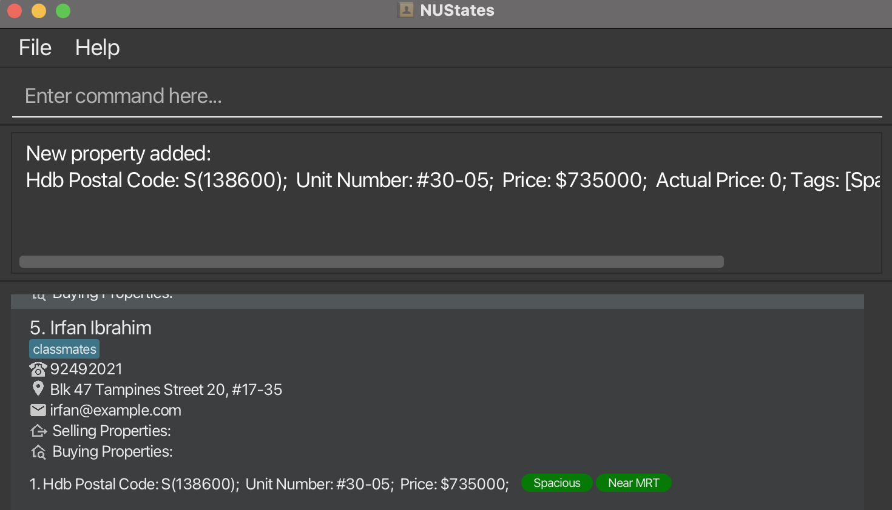
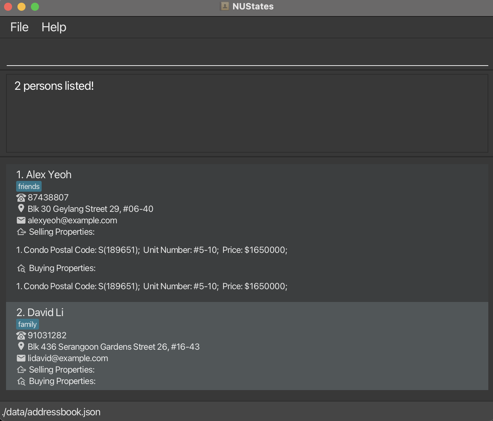
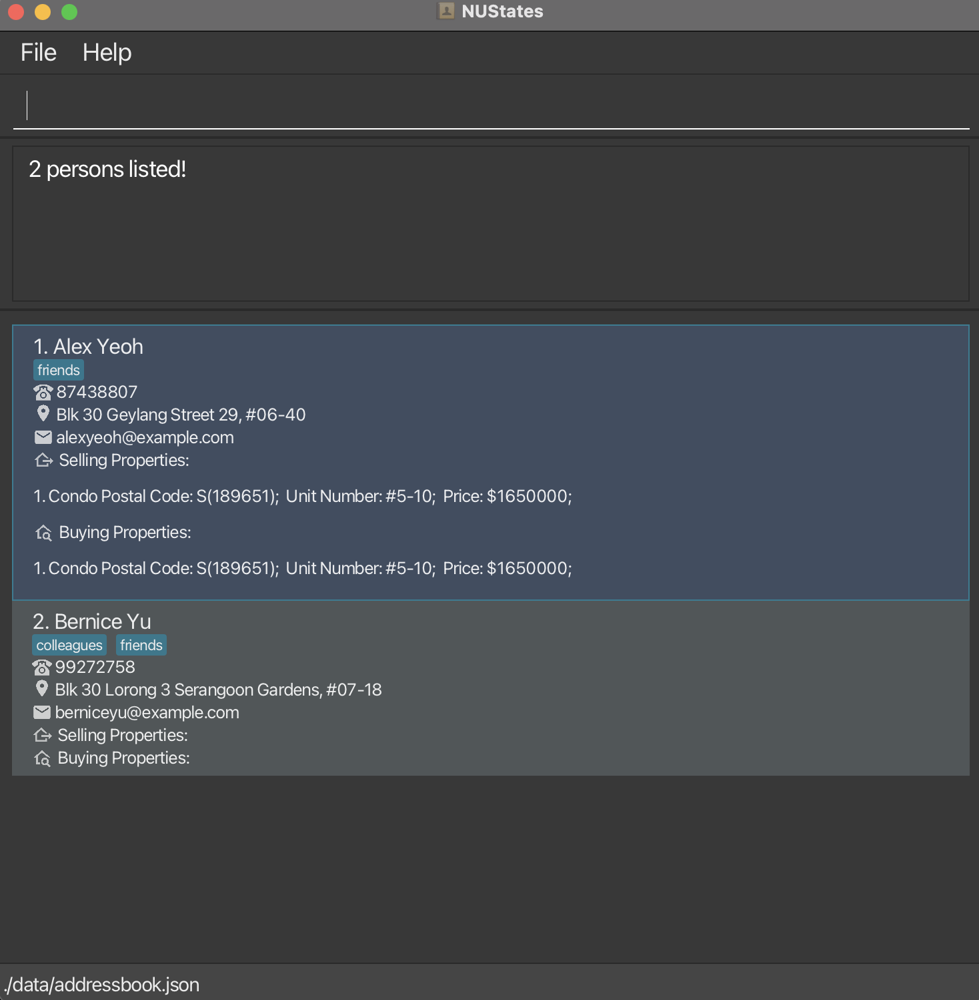
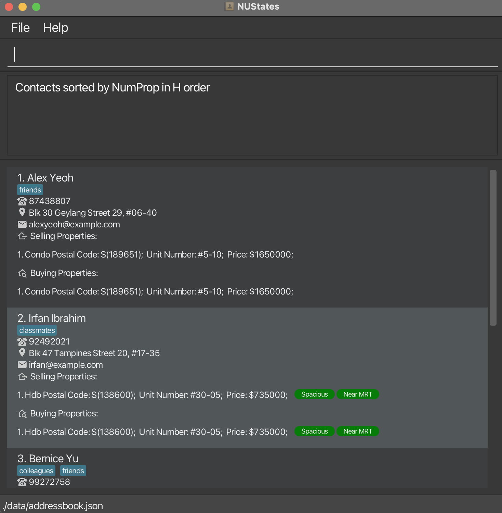
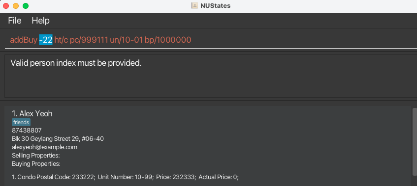

# NUStates User Guide

NUStates is a **desktop application designed to streamline contact and property management** specifically for real estate agents.
Built for **fast, efficient use** through a Command Line Interface (CLI), NUStates enables real estate agents to **organise, categorise, and access their contacts and listings** with speed and precision.

With NUStates, agents can:
- **Manage and Tag Clients**: Easily add, tag, and retrieve client (buyer/seller) details.
- **Search and Filter**: Quickly find contacts by name, phone number, or tags, and sort by various criteria.
- **Pin and Unpin Clients**: Keep high-priority clients at the top for quick access.
- **Scroll through Command History**: Effortlessly scroll through previous commands, making repetitive tasks quicker.
- **View Statistics Dashboard**: View insightful statistics at a glance, such as the number of active clients, properties sold, and performance metrics.

NUStates combines the power of **CLI efficiency** with the clarity of **GUI visuals**, enabling agents to streamline their workflow, stay organised, and focus on what matters—_serving their clients_.

<!-- * Table of Contents -->
# Table of Contents
- [Quick Start](#quick-start)
- [Features](#features)
  - [General Commands](#general-commands)
    - [Viewing help: `help`](#viewing-help--help)
    - [Viewing list of commands: `commands`](#viewing-list-of-commands--commands)
    - [Viewing overall statistics: `stats`](#viewing-overall-statistics--stats)
    - [Clearing all entries: `clear`](#clearing-all-entries--clear)
    - [Exiting the program: `exit`](#exiting-the-program--exit)
  - [Adding Entries Commands](#adding-entries-commands)
    - [Adding a person: `add`](#adding-a-person-add)
    - [Adding a property to buy: `addBuy`](#adding-a-property-to-buy-addbuy)
    - [Adding a property to sell: `addSell`](#adding-a-property-to-sell-addsell)
  - [Editing Entries Command](#editing-entries-command)
    - [Editing a person: `edit`](#editing-a-person--edit)
  - [Deleting Entries Commands](#deleting-entries-commands)
    - [Deleting a person: `delete`](#deleting-a-person--delete)
    - [Deleting a property to be sold: `delSell`](#deleting-a-property-to-be-sold--delsell)
    - [Deleting a property to be bought: `delBuy`](#deleting-a-property-to-be-bought--delbuy)
  - [Finding Entries Commands](#finding-entries-commands)
    - [Finding persons by name: `findn`](#finding-persons-by-name-findn)
    - [Finding persons by phone number: `findp`](#finding-persons-by-phone-number-findp)
    - [Finding persons by tags assigned to them: `findtc`](#finding-persons-by-tags-assigned-to-them-findtc)
    - [Finding persons based on properties to buy: `findBuy`](#finding-persons-based-on-properties-to-buy-findbuy)
    - [Finding properties based on properties to sell: `findSell`](#finding-persons-based-on-properties-to-sell-findsell)
  - [Listing Entries Commands](#listing-entries-commands)
    - [Listing all persons: `list`](#listing-all-persons--list)
    - [Sort all persons: `sort`](#sort-all-persons-sort)
    - [Sort all properties associated with a person: `sorti`](#sort-all-properties-associated-with-a-person-sorti)
  - [Status Commands](#status-commands)
    - [To mark property already bought: `bought`](#to-mark-property-as-bought-bought)
    - [To mark property already sold: `sold`](#to-mark-property-already-sold-sold)
    - [Pin Contact: `pin`](#pin-contact-pin)
    - [Unpin Contact: `unpin`](#unpin-contact-unpin)
  - [Additional Features](#additional-features)
    - [Command history: Up and Down arrow keys](#command-history-up-and-down-arrow-keys)
    - [Highlighting of command errors](#highlighting-of-command-errors)
    - [Saving the data](#saving-the-data)
    - [Editing the data file](#editing-the-data-file)
    - [Archiving data files `[coming in v2.0]`](#archiving-data-files-coming-in-v20)
- [FAQ](#faq)
- [Known Issues](#known-issues)
- [Command Summary](#command-summary)

--------------------------------------------------------------------------------------------------------------------

## Quick start

1. Ensure you have Java `17` or a newer version installed in your computer.
   If you're not sure, you can download and install it from [this link](https://www.oracle.com/java/technologies/javase-jdk17-downloads.html).

2. Download the latest `NUStates.jar` file from [this link](https://github.com/AY2425S1-CS2103T-F10-3/tp/releases).

3. Move the downloaded file to the folder where you want to keep NUStates.

4. Open a command terminal:
    - **Windows**: Press `Win + R`, type `cmd`, and press `Enter`.
    - **macOS**: Press `Cmd + Space`, type `Terminal`, and press `Enter`.

5. Navigate to the folder where you put the `NUStates.jar` file by using the `cd` command:
    - **Windows**: Type `cd` followed by the path to the folder where `NUStates.jar` is located. eg. `cd C:\Users\JohnDoe\Desktop\NUStates`
    - **macOS**: Type `cd` followed by the path to the folder where `NUStates.jar` is located. eg. `cd /Users/JohnDoe/Desktop/NUStates`

6. Run the application by typing `java -jar nustates.jar` in the terminal and pressing `Enter`.

    A GUI similar to the below should appear in a few seconds. Note how the app contains some sample data. 
   

7. Type the command in the command box and press Enter to execute it. e.g. typing **`help`** and pressing Enter will open the help window. 
   Some example commands you can try:

   * `list` : Lists all contacts.

   * `add n/John Doe p/98765432 e/johnd@example.com a/John street, block 123, #01-01` : Adds a contact named `John Doe` to the Address Book.

   * `addBuy 1 ht/c bp/1650000 pc/567510 un/10-65 t/Spacious t/Near MRT` : Adds a property to buy of type `Condo` to the Address Book for the contact at index 1.

   * `addSell 1 ht/c bp/1750000 pc/567510 un/10-65 t/Spacious t/Near MRT` : Adds a property to sell of type `Condo` to the Address Book for the contact at index 1.

   * `delete 3` : Deletes the 3rd contact shown in the current list.

   * `clear` : Deletes all contacts.

   * `exit` : Exits the app.

8. Refer to the [Features](#features) below for details of each command.

--------------------------------------------------------------------------------------------------------------------

## Features

<box type="info" seamless>

**Notes about the command format:** 

* Words in `UPPER_CASE` are the parameters to be supplied by the user. 
  e.g. in `add n/NAME`, `NAME` is a parameter which can be used as `add n/John Doe`.

* Items in square brackets are optional. 
  e.g `n/NAME [t/TAG]` can be used as `n/John Doe t/friend` or as `n/John Doe`.

* Items with `…`​ after them can be used multiple times including zero times, but with a limit of 2 tags. Each tag can have a maximum of 9 characters.  
  e.g. `[t/TAG]…​` can be used as ` ` (i.e. 0 times), `t/friend`, `t/friend t/family` etc.

* Parameters can be in any order. 
  e.g. if the command specifies `n/NAME p/PHONE_NUMBER`, `p/PHONE_NUMBER n/NAME` is also acceptable.

* Extraneous parameters for commands that do not take in parameters (such as `help`, `list`, `exit` and `clear`) will be ignored. 
  e.g. if the command specifies `help 123`, it will be interpreted as `help`.

* If you are using a PDF version of this document, be careful when copying and pasting commands that span multiple lines as space characters surrounding line-breaks may be omitted when copied over to the application.
</box>

## General Commands

### Viewing help : `help`

Shows a message explaining how to access the help page.

Format: `help`

### Viewing list of commands : `commands`

Lists all the commands the address book supports.

Format: `help`

### Viewing overall statistics : `stats`

Displays a comprehensive summary of the address book, including the total number of people, properties, and other key metrics.

Format: `clear`

### Clearing all entries : `clear`

Clears all entries from the address book.

Format: `clear`

### Exiting the program : `exit`

Exits the program.

Format: `exit`

## Adding Entries Commands

### Adding a person: `add`

Adds a person to the address book.

Format: `add n/NAME p/PHONE_NUMBER e/EMAIL a/ADDRESS [t/TAG]…​`

<box type="tip" seamless>

**Tip:** A person can be assigned up to 2 tags and each tag can have a maximum of 9 characters.
</box>

Examples:
* `add n/John Doe p/98765432 e/johnd@example.com a/John street, block 123, #01-01`
* `add n/Betsy Crowe t/friend e/betsycrowe@example.com a/Newgate Prison p/1234567 t/criminal`

### Adding a property to buy: `addBuy`

Adds a property which a client wants to buy to the address book. The property is associated to the specified contact in the Address Book.

Format: `addBuy INDEX_NUMBER ht/HOUSING TYPE bp/BUYING_PRICE pc/POSTAL_CODE un/UNIT_NUMBER [t/TAG]…​`

<box type="tip" seamless>

**Tip:** A property can be assigned up to 2 tags and each tag can have a maximum of 9 characters.
</box>

Examples:
* `addBuy 1 ht/c bp/1650000 pc/189651 un/5-10`
* `addBuy 5 ht/h bp/735000 pc/138600 un/30-05 t/Spacious t/Near MRT`

### Adding a property to sell: `addSell`

Adds a property which a client wants to sell to the address book. The property is associated to the specified contact in the Address Book.

Format: `addSell INDEX_NUMBER ht/HOUSING TYPE sp/SELLING_PRICE pc/POSTAL_CODE un/UNIT_NUMBER [t/TAG]…​`

<box type="tip" seamless>

**Tip:** A Property can be assigned up to 2 tags and each tag can have a maximum of 9 characters.
</box>

Examples:
* `addSell 1 ht/c sp/1650000 pc/189651 un/5-10`
* `addSell 5 ht/h sp/735000 pc/138600 un/30-05 t/Spacious t/Near MRT`

## Editing Entries Command

### Editing a person : `edit`

Edits an existing person in the address book.

Format: `edit INDEX [n/NAME] [p/PHONE] [e/EMAIL] [a/ADDRESS] [t/TAG]…​`

* Edits the person at the specified `INDEX`. The index refers to the index number shown in the displayed person list. The index **must be a positive integer** 1, 2, 3, …​
* At least one of the optional fields must be provided.
* Existing values will be updated to the input values.
* When editing tags, the existing tags of the person will be removed i.e adding of tags is not cumulative.
* You can remove all the person’s tags by typing `t/` without
  specifying any tags after it.

Examples:
*  `edit 1 p/91234567 e/johndoe@example.com` Edits the phone number and email address of the 1st person to be `91234567` and `johndoe@example.com` respectively.
*  `edit 2 n/Alexa Yeah t/` Edits the name of the 2nd person to be `Alexa Yeah` and clears all existing tags.

## Deleting Entries Commands

### Deleting a person : `delete`

Deletes the specified person from the address book.

Format: `delete INDEX`

* Deletes the person at the specified `INDEX`.
* The index refers to the index number shown in the displayed person list.
* The index **must be a positive integer** 1, 2, 3, …​

Examples:
* `list` followed by `delete 2` deletes the 2nd person in the address book.
* `findn Alex` followed by `delete 1` deletes the 1st person in the results of the `findn` command.

### Deleting a property to be bought : `delBuy`

Deletes the specified property which the specified person wants to buy from the address book.

Format: `delBuy INDEX_PERSON INDEX_PROPERTY`

* Deletes the property to be bought at the specified `INDEX_PROPERTY` under the person at the specified `INDEX_PERSON`.
* The index refers to the index number displayed in the buying properties list and person list.
* The index **must be a positive integer** 1, 2, 3, …​

Examples:
* `list` followed by `delBuy 2 1` deletes the 1st buying property under 2nd person in the address book.

### Deleting a property to be sold : `delSell`

Deletes the specified property which the specified person wants to sell from the address book.

Format: `delSell INDEX_PERSON INDEX_PROPERTY`

* Deletes the property to be sold at the specified `INDEX_PROPERTY` under the person at the specified `INDEX_PERSON`.
* The index refers to the index number displayed in the selling properties list and person list.
* The index **must be a positive integer** 1, 2, 3, …​

Examples:
* `list` followed by `delSell 2 1` deletes the 1st selling property under 2nd person in the address book.

## Finding Entries Command

### Finding persons by name: `findn`

Finds persons whose names contain any of the given keywords.

Format: `findn KEYWORD [MORE_KEYWORDS]`

* The search is case-insensitive. e.g `alex` will match `Alex`
* The order of the keywords does not matter. e.g. `Alex Ro` will match `Ro Alex`
* Only the name is searched.
* No need for full words to be matched; For example, `AL` will match `Alex`
* Persons matching at least one keyword will be returned (i.e. `OR` search).
  e.g. `Ro Alex` will return `Alex Yeah`, `Roy Balakrishnan`

Examples:
* `findn John` returns `John Doe`
* `findn alex david` returns `Alex Yeoh`, `David Li` 
  

### Finding persons by phone number: `findp`

Finds persons whose phone number contain any of the given keywords.

Format: `findp KEYWORD [MORE_KEYWORDS]`

* The KEYWORD can only be numeric values
* The order of the keywords does not matter. e.g. `86796692 98765432` will match `98765432 86796692`
* Only the phone number is searched.
* No need for full phone numbers to be matched e.g. `867966` will match `86796692`
* Persons matching at least one keyword will be returned (i.e. `OR` search).
  e.g. ` 87438807 99272758` will return `Alex Yeah`, `Bernice Yu`

Examples:
* `findp 87438807` returns `Alex Yeah`
* `findp 87438807 99272758` returns `Alex Yeoh`, `Bernice Yu` 

### Finding persons by tags assigned to them: `findtc`

Finds persons whose tags matches any of the given keywords.

Format: `findtc KEYWORD [MORE_KEYWORDS]`

* The search is case-insensitive. e.g `friend` will match `Friend`
* The order of the keywords does not matter. e.g. `friend owes` will match `owes Friend`
* Only the tag is searched.
* No need for full words to be matched; For example, `friend` will match `friends`
* Persons matching at least one keyword will be returned (i.e. `OR` search).
  e.g. `friends owes` will return `Alex Yeah`, `Bo Yang`

Examples:
* `findtc friend` returns `Alex Yeah` and `Bernice Yu`
* `findtc friend owes` returns `Alex Yeoh`, `Bernice Yu` 
  

## Finding persons based on properties to buy: `findBuy`

Finds properties in the buy list whose housing type, unit number, address, postal code and buying price contain any of the given keywords.

Format: `findBuy KEYWORD [MORE_KEYWORDS]`

* The KEYWORD can contain any types of value: Strings, Numbers, Special Characters
* The search is case-insensitive. e.g `condo` will match `Condo`
* The order of the keywords does not matter. e.g. `condo 02-205` will match `02-205 condo`
* All the criterias for a property are searched.
* No need for full keywords to be matched (for housing type and tags) e.g. `cond` will match `condo`
* Full keywords must be matched for unit number, postal code and price. e.g. `02` will not match `02-205`
* Person having properties matching at least one keyword will be returned (i.e. `OR` search).
  e.g. ` condo 02-05` will return `Alex Yeah`.

Examples:
* `findBuy condo` returns `Alex Yeoh`
* `findBuy condo 02-05` returns `Alex Yeoh` 
  

## Finding persons based on properties to sell: `findSell`

Finds properties in the sell list whose housing type, unit number, address, postal code and buying price contain any of the given keywords.

Format: `findSell KEYWORD [MORE_KEYWORDS]`

* The KEYWORD can contain any types of value: Strings, Numbers, Special Characters
* The search is case-insensitive. e.g `condo` will match `Condo`
* The order of the keywords does not matter. e.g. `condo 02-205` will match `02-205 condo`
* All the criterias for a property are searched.
* No need for full keywords to be matched (for housing type and tags) e.g. `cond` will match `condo`
* Full keywords must be matched for unit number, postal code and price. e.g. `02` will not match `02-205`
* Person having properties matching at least one keyword will be returned (i.e. `OR` search).
  e.g. ` condo 02-05` will return `Alex Yeah`.

Examples:
* `findSell condo` returns `Alex Yeoh`
* `findSell condo 02-05` returns `Alex Yeoh` 
  

## Listing Entries Commands

### Listing all persons : `list`

Shows a list of all persons along with the properties associated with them in the address book.

Format: `list`

### Sort all persons: `sort`

Sorts the list of contacts by a specified field and order, with pinned contacts appearing before unpinned contacts.

Format: `sort f/FIELD o/ORDER`

* The parameters FIELD and ORDER are case-sensitive.
* The FIELD parameter can be `Name` or `NumProp`.
* The ORDER parameter can be `L` for ascending (Low to High) and `H` for descending (High to Low).

Examples:
* `sort f/Name o/L` returns the contact list sorted in ascending order with respect to the name associated with a contact.
* `sort f/NumProp o/H` returns the contact list sorted in descending order with respect to the property list associated with the contact.
  

### Sort all properties associated with a person: `sorti`

Sorts the list of properties associated with a contact by a specified field and order. This sorted order resets every time the app closes, so the command needs to be run again each time the app re-opens.

Format: `sorti INDEX f/FIELD o/ORDER`

* The INDEX **must be a positive integer** 1, 2, 3, …​
* The parameters FIELD and ORDER are case-sensitive.
* The FIELD parameter can be `Price`
* The ORDER parameter can be `L` for ascending and `H` for descending.

Examples:
* `sorti 1 f/Price o/L` returns the property list for contact at index 1 sorted in ascending order with respect to the price associated to it.

## Status Commands

### To mark property as bought: `bought`
Records the property that has been purchased using the index number of the person and the index number of the property-to-buy in the displayed persons list. This command also removes the purchased property from the property-to-buy list.

Format `bought PERSON_INDEX PROPERTY_TO_BUY_INDEX ap/ACTUAL_PRICE`

* The parameters PERSON_INDEX and PROPERTY_TO_BUY_INDEX must be positive integers.
* The ACTUAL_PRICE must be a valid numerical value.

Examples:
* `bought 1 1 ap/1110000` marks property to buy 1 for contact 1 as bought and removes from list.

### To mark property already sold: `sold`
Records the property that has been sold using the index number of the person and the index number of the property-to-sell in the displayed persons list. This command also removes the purchased property from the property-to-sell list.

Format `sold PERSON_INDEX PROPERTY_TO_SELL_INDEX ap/ACTUAL_PRICE`

* The parameters PERSON_INDEX and PROPERTY_TO_BUY_INDEX must be positive integers.
* The ACTUAL_PRICE must be a valid numerical value.

Examples:
* `sold 1 1 ap/1110000` marks property to sell 1 for contact 1 as sold and removes from list.

### Pin Contact `pin`
Pins an unpinned contact at a particular index to the top of the list.

Format `pin INDEX`

* The parameter INDEX must be a positive integer.

Examples:
* `pin 5` moves the contact at index 5 to index 1.

### Unpin Contact `unpin`

Unpins a pinned contact at a particular index from the top of the list to its sorted position.

Format `unpin INDEX`

* The parameter INDEX must be a positive integer.

* `unpin 1` moves the contact at index 1 back to its sorted position.

## Additional Features

### Command history: Up and Down arrow keys
NUStates keeps a history of the commands you have entered. You can navigate through this history using the up and down arrow keys.

- **Up Arrow Key**: Pressing the up arrow key will cycle through the previous commands you have entered, starting from the most recent one.
- **Down Arrow Key**: Pressing the down arrow key will cycle forward through the command history, allowing you to revisit commands you have skipped over.

This feature is particularly useful for quickly re-executing previous commands without having to retype them.

Examples:
1. After entering several commands, press the **up arrow key** to view the last command you entered.
2. Continue pressing the **up arrow key** to cycle through older commands.
3. If you go too far back, press the **down arrow key** to move forward in the command history.

### Highlighting of command errors

NUStates will highlight any specific errors in the command entered by the user. This feature helps users quickly identify and correct any mistakes in their commands.

- **Unknown Command**: If the command entered is not recognized by NUStates, it will highlight the invalid command keyword and provide a message indicating that the command is unknown.
- **Missing Preamble Value**: If required preamble value is invalid (e.g., non-positive values where positive numbers are expected), NUStates will highlight the invalid preamble value and provide a message indicating the expected format.
- **Invalid Parameter Values**: If any parameter values are invalid (e.g., non-numeric values where numbers are expected), NUStates will highlight the invalid values and provide a message indicating the expected format.
- **Invalid Command Format and Other Errors**: For incorrect command format and other errors, NUStates will not highlight any specific part of the command but will provide a message indicating the correct format. This includes missing parameters, incorrect command structure, and other general errors.

Examples:
1. **Unknown Command**:
  - Command entered: `ad n/John Doe p/98765432 e/johnd@example.com a/John street, block 123, #01-01`
  - Cause: The command `ad` is not recognised.
  - Highlight: The `ad` part is highlighted.

2. **Invalid Preamble Value**:
  - Command entered: `addBuy -22 ht/c pc/999111 un/10-01 bp/1000000`
  - Cause: The person index `-22` is invalid.
  - Highlight: The invalid `-22` part is highlighted.

3. **Invalid Parameter Values**:
  - Command entered: `add n/John Doe p/abc e/johnd@example.com a/John street, block 123, #01-01`
  - Cause: The phone number `abc` is invalid.
  - Highlight: The `p/abc` part is highlighted.

4. **Invalid Command Format and Other Errors**:
  - Command entered: `addBuy 1 pc/999111 un/10-01 bp/1000000`
  - Cause: The housing type parameter `ht/` is missing.
  - Highlight: No specific part is highlighted.

### Saving the data

AddressBook data are saved in the hard disk automatically after any command that changes the data. There is no need to save manually.

### Editing the data file

AddressBook data are saved automatically as a JSON file `[JAR file location]/data/addressbook.json`. Advanced users are welcome to update data directly by editing that data file.

<box type="warning" seamless>

**Caution:**
If your changes to the data file makes its format invalid, AddressBook will discard all data and start with an empty data file at the next run.  Hence, it is recommended to take a backup of the file before editing it. 
Furthermore, certain edits can cause the AddressBook to behave in unexpected ways (e.g., if a value entered is outside the acceptable range). Therefore, edit the data file only if you are confident that you can update it correctly.
</box>

### Archiving data files `[coming in v2.0]`

_Details coming soon ..._

--------------------------------------------------------------------------------------------------------------------

## FAQ

**Q**: What platform does NUStates support? 
**A**: NUStates is available for Windows, macOS, and Linux. Please ensure your system meets the minimum requirements for installation. Check [Quick Start](#quick-start) for system requirements.

**Q**: How do I transfer my data to another Computer? 
**A**: Install the app in the other computer and overwrite the empty data file it creates with the file that contains the data of your previous AddressBook home folder.

**Q**: The app is running slowly; What should i do? 
**A**: Try restarting the application. If the problem persists, ensure your computer meets the app’s performance requirements and consider clearing any unnecessary data.

--------------------------------------------------------------------------------------------------------------------

## Known issues

1. **When using multiple screens**, if you move the application to a secondary screen, and later switch to using only the primary screen, the GUI will open off-screen. The remedy is to delete the `preferences.json` file created by the application before running the application again.
2. **If you minimize the Help Window** and then run the `help` command (or use the `Help` menu, or the keyboard shortcut `F1`) again, the original Help Window will remain minimized, and no new Help Window will appear. The remedy is to manually restore the minimized Help Window.
3. **After a property is added** it is not instantly reflected on the Ui. It is reflected on the Ui after a delay. To resolve this,can either wait for a bit or scroll the screen up and down or click on the contact you added the property to.
4. **Bug in edit command**, the edit command overwrites the property list and deletes them when a person is edited/modified.
5. **Same Property to Sell** can be tagged to various contacts
6. **delSell and delBuy** only works with the index displayed using the `list` command and not `findn` or `findp` command.

--------------------------------------------------------------------------------------------------------------------

## Command summary

Action     | Format, Examples
-----------|-----------------------------------------------------------------------------------------------------------------------------------------------------------------
**Help**   | `help`
**Command List** | `commands`
**Statistics**   | `stats`
**Clear**  | `clear`
**Exit**  | `exit`
**Add**    | `add n/NAME p/PHONE_NUMBER e/EMAIL a/ADDRESS [t/TAG]…​`   e.g., `add n/James Ho p/22224444 e/jamesho@example.com a/123, Clementi Rd, 1234665 t/friend t/colleague`
**Add Property** | `addBuy INDEX_NUMBER ht/HOUSING TYPE bp/BUYING_PRICE pc/POSTAL_CODE un/UNIT_NUMBER [t/TAG]…​`   e.g., `addBuy 5 ht/h bp/735000 pc/138600 un/30-05 t/Spacious/Near MRT`
**Add Property** | `addSell INDEX_NUMBER ht/HOUSING TYPE sp/SELLING_PRICE pc/POSTAL_CODE un/UNIT_NUMBER [t/TAG]…​`   e.g., `addSell 5 ht/h sp/735000 pc/138600 un/30-05 t/Spacious/Near MRT`
**Edit**   | `edit INDEX [n/NAME] [p/PHONE_NUMBER] [e/EMAIL] [a/ADDRESS] [t/TAG]…​`  e.g.,`edit 2 n/James Lee e/jameslee@example.com`
**Delete** | `delete INDEX`  e.g., `delete 3`
**Delete Property** | `delSell INDEX_PERSON INDEX_PROPERTY`  e.g., `delSell 3 2`
**Delete Property** | `delBuy INDEX_PERSON INDEX_PROPERTY`  e.g., `delBuy 3 2`
**Find using Name**   | `findn KEYWORD [MORE_KEYWORDS]`  e.g., `findn James Jak`
**Find using Phone Number**   | `findp KEYWORD [MORE_KEYWORDS]`  e.g., `findp 98272758 85495438`
**Find using Tag**   | `findtc KEYWORD [MORE_KEYWORDS]`  e.g., `findtc friend owes`
**Find using Property**   | `findBuy KEYWORD [MORE_KEYWORDS]`  e.g., `findBuy condo 02-21`
**Find using Property**   | `findSell KEYWORD [MORE_KEYWORDS]`  e.g., `findSell hdb 21345`
**List**   | `list`
**Sort Person**   | `sort f/FIELD o/ORDER`  e.g., `sort f/Name o/L`
**Sort Property**   | `sorti INDEX f/FIELD o/ORDER`  e.g., `sorti 1 f/Price o/L`
**Mark Property as bought**   | `bought PERSON_INDEX PROPERTY_TO_BUY_INDEX ap/ACTUAL PRICE`  e.g., `bought 1 2 ap/1250000`
**Mark Property as sold**   | `sold PERSON_INDEX PROPERTY_TO_SELL_INDEX ap/ACTUAL PRICE`  e.g., `sold 2 2 ap/1050000`
**Pin** | `pin INDEX`  e.g., `pin 3`
**Unpin** | `unpin INDEX`  e.g., `unpin 1`

